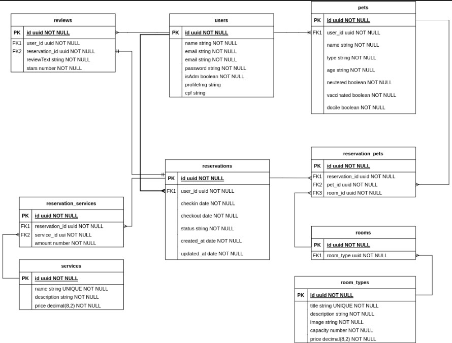

 

<h1 align="center">Me Au API</h1>

  

  

  <a href="https://me-au.vercel.app/">
Link da documentação da API</a>

<!-- ABOUT THE PROJECT -->

## Sobre o projeto

O projeto é uma API construída para o desenvolvimento do projeto full-stack de
um pet hotel: <a href="https://me-au.vercel.app/">Me-Au</a>. Para visualização
da documentação da API
<a href="https://m4-projeto-final.github.io/me-au-docs/">clique aqui</a>.

## Tecnologias utilizadas

- TypeScript;
- Node;
- PostgreSQL;
- TypeORM;

## Diagrama ER

